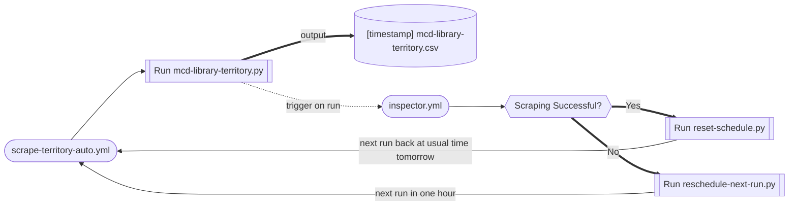
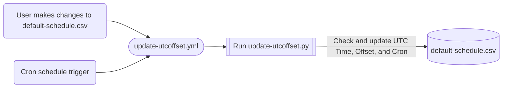

# McDelivery Menu Logger (APAC Region)

## Overview

*McDonald's allows its franchisees some leeway in menu pricing, hence there may be a slight variation in in-store prices across different franchise locations in the same country. Such prices are not widely accessible online.*

Price figures recorded here are from each territory's online McDelivery menu, which is consistent within said country / territory.

### Table of Links

#### What Each Column is For
>**`Vendor Page`** *points to the official McDelivery order webpage, or, if it is not accessible by script, to an assigned delivery partner.*<br/>
>**`Scraper Script`** *is a direct link to the .py script that is executed by the workflow to scrape menu data.*<br/>
>**`Scraped Files`** *links to the folder holding the scraped data in csv file format.*<br/>
>**`Workflow File`** *is a direct link to the auto scraper file that is automatically triggered by a cron schedule.*

<br/>

| Vendor Page         | Scraper Script | Scraped Files    | Workflow File                             |
|:-------------------:| :------------- |:----------------:| -----------------------------------------:|
| [][au]    | [Australia]    | [mcd-scr-au.csv] | [![scrape-au-auto.yml][au-logo]][au-yaml] |
| [][bn]    | [Brunei]       | [mcd-scr-bn.csv] | [![scrape-bn-auto.yml][bn-logo]][bn-yaml] |
| [][fj]    | [Fiji]         | [mcd-sel-fj.csv] | [![scrape-fj-auto.yml][fj-logo]][fj-yaml] |
| [][hk]    | [Hong Kong]    | [mcd-scr-hk.csv] | [![scrape-hk-auto.yml][hk-logo]][hk-yaml] |
| [][in]    | [India]        | [mcd-req-in.csv] | [![scrape-in-auto.yml][in-logo]][in-yaml] |
| [][id]    | [Indonesia]    | [mcd-bs4-id.csv] | [![scrape-id-auto.yml][id-logo]][id-yaml] |
| [][jp]    | [Japan]        | [mcd-bs4-jp.csv] | [![scrape-jp-auto.yml][jp-logo]][jp-yaml] |
| [][kr]    | [South Korea]        | [mcd-bs4-kr.csv] | [![scrape-kr-auto.yml][kr-logo]][kr-yaml] |
| [][my]    | [Malaysia]     | [mcd-bs4-my.csv] | [![scrape-my-auto.yml][my-logo]][my-yaml] |
| [][nz]    | [New Zealand]  | [mcd-scr-nz.csv] | [![scrape-nz-auto.yml][nz-logo]][nz-yaml] |
| [][pk]    | [Pakistan]     | [mcd-bs4-pk.csv] | [![scrape-pk-auto.yml][pk-logo]][pk-yaml] |
| [][ph]    | [Philippines]  | [mcd-scr-ph.csv] | [![scrape-ph-auto.yml][ph-logo]][ph-yaml] |
| [][sg]    | [Singapore]    | [mcd-bs4-sg.csv] | [![scrape-sg-auto.yml][sg-logo]][sg-yaml] |
| [][lk]    | [Sri Lanka]    | [mcd-bs4-lk.csv] | [![scrape-lk-auto.yml][lk-logo]][lk-yaml] |
| [][tw]    | [Taiwan]       | [mcd-bs4-tw.csv] | [![scrape-tw-auto.yml][tw-logo]][tw-yaml] |
| [][th]    | [Thailand]     | [mcd-bs4-th.csv] | [![scrape-th-auto.yml][th-logo]][th-yaml] |
| [][vn]    | [Vietnam]      | [mcd-bs4-vn.csv] | [![scrape-vn-auto.yml][vn-logo]][vn-yaml] |


[mcdelivery]: 
[ubereats]: 
[foodpanda]: 
[gomamam]: 
[fijieats]: 


[au]: https://www.ubereats.com/au/store/mcdonalds-clifton-hill/SIaq6LrDTFemKVajhXM-iA
[Australia]: https://github.com/schmwong/APAC-McDelivery-Menu-Logger/blob/main/mcd-scr-au/mcd/spiders/mcd-scr-au.py
[mcd-scr-au.csv]: https://github.com/schmwong/APAC-McDelivery-Menu-Logger/tree/main/mcd-scr-au/scraped-data
[au-logo]: https://github.com/schmwong/APAC-McDelivery-Menu-Logger/actions/workflows/scrape-au-auto.yml/badge.svg
[au-yaml]: https://github.com/schmwong/APAC-McDelivery-Menu-Logger/blob/main/.github/workflows/scrape-au-auto.yml

[bn]: https://www.gomamam.com/mcdonaldsgadong
[Brunei]: https://github.com/schmwong/APAC-McDelivery-Menu-Logger/blob/main/mcd-scr-bn/mcd/spiders/mcd-scr-bn.py
[mcd-scr-bn.csv]: https://github.com/schmwong/APAC-McDelivery-Menu-Logger/tree/main/mcd-scr-bn/scraped-data
[bn-logo]: https://github.com/schmwong/APAC-McDelivery-Menu-Logger/actions/workflows/scrape-bn-auto.yml/badge.svg
[bn-yaml]: https://github.com/schmwong/APAC-McDelivery-Menu-Logger/blob/main/.github/workflows/scrape-bn-auto.yml

[fj]: https://fijieats.com/vendor/mcdonalds-nadi
[Fiji]: https://github.com/schmwong/APAC-McDelivery-Menu-Logger/blob/main/mcd-sel-fj/mcd-sel-fj.py
[mcd-sel-fj.csv]: https://github.com/schmwong/APAC-McDelivery-Menu-Logger/tree/main/mcd-sel-fj/scraped-data
[fj-logo]: https://github.com/schmwong/APAC-McDelivery-Menu-Logger/actions/workflows/scrape-fj-auto.yml/badge.svg
[fj-yaml]: https://github.com/schmwong/APAC-McDelivery-Menu-Logger/blob/main/.github/workflows/scrape-fj-auto.yml

[hk]: https://www.foodpanda.hk/restaurant/q8hc/mcdonalds-and-mccafe-admiralty-centre
[Hong Kong]: https://github.com/schmwong/APAC-McDelivery-Menu-Logger/blob/main/mcd-scr-hk/mcd/spiders/mcd-scr-hk.py
[mcd-scr-hk.csv]: https://github.com/schmwong/APAC-McDelivery-Menu-Logger/tree/main/mcd-scr-hk/scraped-data
[hk-logo]: https://github.com/schmwong/APAC-McDelivery-Menu-Logger/actions/workflows/scrape-hk-auto.yml/badge.svg
[hk-yaml]: https://github.com/schmwong/APAC-McDelivery-Menu-Logger/blob/main/.github/workflows/scrape-hk-auto.yml

[in]: https://www.mcdelivery.co.in/home
[India]: https://github.com/schmwong/APAC-McDelivery-Menu-Logger/blob/main/mcd-req-in/mcd-api-in.py
[mcd-req-in.csv]: https://github.com/schmwong/APAC-McDelivery-Menu-Logger/tree/main/mcd-req-in/scraped-data
[in-logo]: https://github.com/schmwong/APAC-McDelivery-Menu-Logger/actions/workflows/scrape-in-auto.yml/badge.svg
[in-yaml]: https://github.com/schmwong/APAC-McDelivery-Menu-Logger/blob/main/.github/workflows/scrape-in-auto.yml

[id]: https://www.mcdelivery.co.id/id/browse/menu.html?daypartId=1&locale=en
[Indonesia]: https://github.com/schmwong/APAC-McDelivery-Menu-Logger/blob/main/mcd-bs4-id/mcd-bs4-id.py
[mcd-bs4-id.csv]: https://github.com/schmwong/APAC-McDelivery-Menu-Logger/tree/main/mcd-bs4-id/scraped-data
[id-logo]: https://github.com/schmwong/APAC-McDelivery-Menu-Logger/actions/workflows/scrape-id-auto.yml/badge.svg
[id-yaml]: https://github.com/schmwong/APAC-McDelivery-Menu-Logger/blob/main/.github/workflows/scrape-id-auto.yml

[jp]: https://www.mcdonalds.co.jp/en/mcdelivery/menu/
[Japan]: https://github.com/schmwong/APAC-McDelivery-Menu-Logger/blob/main/mcd-bs4-jp/mcd-bs4-jp-v2.py
[mcd-bs4-jp.csv]: https://github.com/schmwong/APAC-McDelivery-Menu-Logger/tree/main/mcd-bs4-jp/scraped-data
[jp-logo]: https://github.com/schmwong/APAC-McDelivery-Menu-Logger/actions/workflows/scrape-jp-auto.yml/badge.svg
[jp-yaml]: https://github.com/schmwong/APAC-McDelivery-Menu-Logger/blob/main/.github/workflows/scrape-jp-auto.yml

[kr]: https://www.mcdelivery.co.kr/kr/browse/menu.html?daypartId=1&catId=10&locale=en
[South Korea]: https://github.com/schmwong/APAC-McDelivery-Menu-Logger/blob/main/mcd-bs4-kr/mcd-bs4-kr.py
[mcd-bs4-kr.csv]: https://github.com/schmwong/APAC-McDelivery-Menu-Logger/tree/main/mcd-bs4-kr/scraped-data
[kr-logo]: https://github.com/schmwong/APAC-McDelivery-Menu-Logger/actions/workflows/scrape-kr-auto.yml/badge.svg
[kr-yaml]: https://github.com/schmwong/APAC-McDelivery-Menu-Logger/blob/main/.github/workflows/scrape-kr-auto.yml

[my]: https://www.mcdelivery.com.my/my/browse/menu.html?daypartId=9&catId=74&locale=en
[Malaysia]: https://github.com/schmwong/APAC-McDelivery-Menu-Logger/blob/main/mcd-bs4-my/mcd-bs4-my.py
[mcd-bs4-my.csv]: https://github.com/schmwong/APAC-McDelivery-Menu-Logger/tree/main/mcd-bs4-my/scraped-data
[my-logo]: https://github.com/schmwong/APAC-McDelivery-Menu-Logger/actions/workflows/scrape-my-auto.yml/badge.svg
[my-yaml]: https://github.com/schmwong/APAC-McDelivery-Menu-Logger/blob/main/.github/workflows/scrape-my-auto.yml

[nz]: https://www.ubereats.com/nz/store/mcdonalds-point-chevalier/1h7CdIIqR-GG5jVOuHqoFA
[New Zealand]: https://github.com/schmwong/APAC-McDelivery-Menu-Logger/blob/main/mcd-scr-nz/mcd/spiders/mcd-scr-nz.py
[mcd-scr-nz.csv]: https://github.com/schmwong/APAC-McDelivery-Menu-Logger/tree/main/mcd-scr-nz/scraped-data
[nz-logo]: https://github.com/schmwong/APAC-McDelivery-Menu-Logger/actions/workflows/scrape-nz-auto.yml/badge.svg
[nz-yaml]: https://github.com/schmwong/APAC-McDelivery-Menu-Logger/blob/main/.github/workflows/scrape-nz-auto.yml

[pk]: https://www.mcdelivery.com.pk/pk/browse/menu.html?daypartId=1&catId=12
[Pakistan]: https://github.com/schmwong/APAC-McDelivery-Menu-Logger/blob/main/mcd-bs4-pk/mcd-bs4-pk.py
[mcd-bs4-pk.csv]: https://github.com/schmwong/APAC-McDelivery-Menu-Logger/tree/main/mcd-bs4-pk/scraped-data
[pk-logo]: https://github.com/schmwong/APAC-McDelivery-Menu-Logger/actions/workflows/scrape-pk-auto.yml/badge.svg
[pk-yaml]: https://github.com/schmwong/APAC-McDelivery-Menu-Logger/blob/main/.github/workflows/scrape-pk-auto.yml

[ph]: https://mcdelivery.com.ph
[Philippines]: https://github.com/schmwong/APAC-McDelivery-Menu-Logger/blob/main/mcd-scr-ph/mcd/spiders/mcd-scr-ph.py
[mcd-scr-ph.csv]: https://github.com/schmwong/APAC-McDelivery-Menu-Logger/tree/main/mcd-scr-ph/scraped-data
[ph-logo]: https://github.com/schmwong/APAC-McDelivery-Menu-Logger/actions/workflows/scrape-ph-auto.yml/badge.svg
[ph-yaml]: https://github.com/schmwong/APAC-McDelivery-Menu-Logger/blob/main/.github/workflows/scrape-ph-auto.yml

[sg]: https://www.mcdelivery.com.sg/sg/browse/menu.html?daypartId=21&catId=29
[Singapore]: https://github.com/schmwong/APAC-McDelivery-Menu-Logger/blob/main/mcd-bs4-sg/mcd-bs4-sg.py
[mcd-bs4-sg.csv]: https://github.com/schmwong/APAC-McDelivery-Menu-Logger/tree/main/mcd-bs4-sg/scraped-data
[sg-logo]: https://github.com/schmwong/APAC-McDelivery-Menu-Logger/actions/workflows/scrape-sg-auto.yml/badge.svg
[sg-yaml]: https://github.com/schmwong/APAC-McDelivery-Menu-Logger/blob/main/.github/workflows/scrape-sg-auto.yml

[lk]: https://www.mcdelivery.lk/lk/browse/menu.html?daypartId=1&catId=2
[Sri Lanka]: https://github.com/schmwong/APAC-McDelivery-Menu-Logger/blob/main/mcd-bs4-lk/mcd-bs4-lk.py
[mcd-bs4-lk.csv]: https://github.com/schmwong/APAC-McDelivery-Menu-Logger/tree/main/mcd-bs4-lk/scraped-data
[lk-logo]: https://github.com/schmwong/APAC-McDelivery-Menu-Logger/actions/workflows/scrape-lk-auto.yml/badge.svg
[lk-yaml]: https://github.com/schmwong/APAC-McDelivery-Menu-Logger/blob/main/.github/workflows/scrape-lk-auto.yml

[tw]: https://www.mcdelivery.com.tw/tw/browse/menu.html?daypartId=45&locale=en
[Taiwan]: https://github.com/schmwong/APAC-McDelivery-Menu-Logger/blob/main/mcd-bs4-tw/mcd-bs4-tw.py
[mcd-bs4-tw.csv]: https://github.com/schmwong/APAC-McDelivery-Menu-Logger/tree/main/mcd-bs4-tw/scraped-data
[tw-logo]: https://github.com/schmwong/APAC-McDelivery-Menu-Logger/actions/workflows/scrape-tw-auto.yml/badge.svg
[tw-yaml]: https://github.com/schmwong/APAC-McDelivery-Menu-Logger/blob/main/.github/workflows/scrape-tw-auto.yml

[th]: https://www.mcdonalds.co.th/mcDelivery/nonMember/category/promotion&lang=en
[Thailand]: https://github.com/schmwong/APAC-McDelivery-Menu-Logger/blob/main/mcd-bs4-th/mcd-bs4-th-v2.py
[mcd-bs4-th.csv]: https://github.com/schmwong/APAC-McDelivery-Menu-Logger/tree/main/mcd-bs4-th/scraped-data
[th-logo]: https://github.com/schmwong/APAC-McDelivery-Menu-Logger/actions/workflows/scrape-th-auto.yml/badge.svg
[th-yaml]: https://github.com/schmwong/APAC-McDelivery-Menu-Logger/blob/main/.github/workflows/scrape-th-auto.yml

[vn]: https://mcdelivery.vn/vn/browse/menu.html?daypartId=1&catId=1&locale=en
[Vietnam]: https://github.com/schmwong/APAC-McDelivery-Menu-Logger/blob/main/mcd-bs4-vn/mcd-bs4-vn.py
[mcd-bs4-vn.csv]: https://github.com/schmwong/APAC-McDelivery-Menu-Logger/tree/main/mcd-bs4-vn/scraped-data
[vn-logo]: https://github.com/schmwong/APAC-McDelivery-Menu-Logger/actions/workflows/scrape-vn-auto.yml/badge.svg
[vn-yaml]: https://github.com/schmwong/APAC-McDelivery-Menu-Logger/blob/main/.github/workflows/scrape-vn-auto.yml

### Exclusions

Delivery fees are not included. Surcharges for drink changes and menu upsizes are also not included. Vouchers, in-store and in-app promotions are not included, unless explicitly itemised in the vendor's webpage scraped by the script.

### USD for Price Comparison

For ease of comparison, all prices are recorded in both local currency and USD.

The exchange rate is fetched live from [Xe.com](https://www.xe.com/currencyconverter/) just prior to scraping McDelivery menu data. This rate is the ***mid-market*** rate, **not** the send rate. Please do not rely on it to make purchases.

<br/>

## Project Architecture and Nomenclature

```
.
├── .github/workflows/
│   ├── Auto scraper workflow files
│   └── Maintenance workflow files
├── Territory folders: mcd-<library>-<ccTLD>/
│   ├── Scraper Script
│   └── scraped-data/
│       └── Scraped Files
├── default-schedule.csv
└── .py Maintenance scripts
```

### 1. Territory Folders

Except the workflow files, each territory has its associated files sequestered in its own folder. There are no shared user modules. Each territory, as a separate entity, has its code developed individually.

The territory folder and its associated files follow a common naming convention: <br/>
>`mcd-<library>-<ccTLD>` <br/>

**Scraped data files** are housed in a `scraped-data` folder within the territory folder. Each file is prefixed with an additional timestamp
>`[yyyy-mm-dd hh:mm:ss]`

in ***Local*** Date and Time.

<details>
  <summary>
    <strong>mcd</strong> prefix : scraping McDonald's data.
  </summary>
</details>

<details>
  <summary>
    <strong>library</strong> : main library or framework used to scrape webpage data. Click for details.

  </summary>

  - `bs4` : [Beautiful Soup 4](https://beautiful-soup-4.readthedocs.io/en/latest/)
  - `req` : [Requests](https://requests.readthedocs.io/en/latest/)
  - `scr` : [Scrapy](https://docs.scrapy.org/en/latest/)
  - `sel` : [Selenium WebDriver](https://www.selenium.dev/documentation/webdriver/)
  
</details>

<details>
  <summary>
    <strong>ccTLD</strong> suffix : country code top-level domain of each APAC territory. Click for details.
  </summary>
  
  - `au` : Australia
  - `bn` : Brunei
  - `fj` : Fiji
  - `hk` : Hong Kong
  - `in` : India
  - `id` : Indonesia
  - `jp` : Japan
  - `kr` : South Korea
  - `my` : Malaysia
  - `nz` : New Zealand
  - `pk` : Pakistan
  - `ph` : Philippines
  - `sg` : Singapore
  - `lk` : Sri Lanka
  - `tw` : Taiwan
  - `th` : Thailand
  - `vn` : Vietnam
  
</details>

### Example

File tree with associated files for Singapore.

```
.
├── .github/workflows/
│   └── scrape-sg-auto.yml
└── mcd-bs4-sg/
    ├── mcd-bs4-sg.py
    └── scraped-data/
        ├── [2022-08-15 03:30:57] mcd-bs4-sg.csv
        └── [2022-08-16 03:31:12] mcd-bs4-sg.csv
```


### 2. [Workflows](https://github.com/schmwong/APAC-McDelivery-Menu-Logger/tree/main/.github/workflows) and Maintenance Scripts




#### Scraper workflows:

Automated scraper files, one for each territory, execute its scraper script in a GitHub hosted virtual machine.
They are triggered on cron schedules defined in [`default-schedule.csv`](https://github.com/schmwong/APAC-McDelivery-Menu-Logger/blob/main/default-schedule.csv).

#### Maintenance workflows:
  
<details>
  <summary>
    <strong>inspector.yml</strong> : runs after every scraper workflow finishes running to execute scripts depending on the result of the scraper workflow. Click for description of each script.
  </summary>
  
  These scripts edit the cron values in workflow .yml files.
  
  - [`reschedule-next-run.py`](https://github.com/schmwong/APAC-McDelivery-Menu-Logger/blob/main/reschedule-next-run.py) : executes on ***failure*** of scraper workflow, ensures scrape reattempt by rescheduling the next run to be one hour from the last scheduled run.
  
  - [`reset-schedule.py`](https://github.com/schmwong/APAC-McDelivery-Menu-Logger/blob/main/reset-schedule.py) : executes on ***success*** of scraper workflow, resets the schedule back to the original cron value defined in [`default-schedule.csv`](https://github.com/schmwong/APAC-McDelivery-Menu-Logger/blob/main/default-schedule.csv).
  
</details>



<details>
  <summary>
    <strong>update-utcoffset.yml</strong> : maintains data accuracy in <strong>default-schedule.csv</strong>.
    Triggered on schedule once a day, and when <strong>default-schedule.csv</strong> is edited. Executes
    <a href="https://github.com/schmwong/APAC-McDelivery-Menu-Logger/blob/main/update-utcoffset.py">
      <strong>update-utcoffset.py</strong>
    </a>
    to ensure UTC offset values are current (for Daylight Savings), and UTC Time values (and Cron values)
    are corrected after user edits are made to Local Time values.
  </summary>
</details>


## Disclaimer

Use of these scripts is limited only to **non-sensitive and publicly available data**.

The automated scripts wholly rely on virtual machines hosted by GitHub Actions to execute them. While every effort has been made to ensure timely execution, there have been instances of [temporary disruption to GitHub services](https://www.githubstatus.com/). Scheduled events are often delayed, more so especially during periods of high loads of GitHub Action workflow runs.

The material embodied in this repository is provided to you "as-is" and without warranty of any kind, express, implied or otherwise, including without limitation, any warranty of fitness for a particular purpose. In no event shall the author be liable to you or anyone else for any direct, special, incidental, indirect or consequential damages of any kind, or any damages whatsoever, including without limitation, loss of profit, loss of use, savings or revenue, or the claims of third parties, whether or not the author has been advised of the possibility of such loss, however caused and on any theory of liability, arising out of or in connection with the possession, use or performance of this repository.
